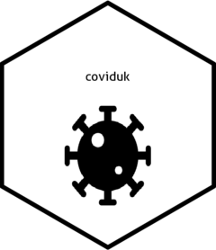

<!-- README.md is generated from README.Rmd. Please edit that file -->

```{r, include = FALSE}
knitr::opts_chunk$set(
  collapse = TRUE,
  comment = "#>",
  fig.path = "man/figures/README-",
  out.width = "100%"
)
```

# coviduk

<!-- badges: start -->
[](https://www.tidyverse.org/lifecycle/#experimental)

<!-- badges: end -->

The goal of coviduk is to make it easier to get data out of the official [UK SARS-CoV-2 dashboard](https://coronavirus.data.gov.uk/). It does this by wrapping up the API calls in simpler functions, reducing the need to set various parameters manually and reduce repetitive code.

Currently the package only handles hospital admissions data (new daily admissions and cumulative totals), but a more expansive range of data will be built in, at least until the government's developers release the R package promised in their [developer's guide](https://coronavirus.data.gov.uk/developers-guide).

## Installation

You can install the development version of coviduk from Github.

``` {r install, eval = F}
devtools::install_github("shanej90/coviduk", ref = "main")
```

## How it works
As there's only one in-use function for now:

`get_hospital_admissions` will call hospitilisation data for a chosen region and date range. The results will be presented as a dataframe, stating the date, region and number of new and cumulative/total admissions since records started.

The paramters you input will create a query to send to the coronavirus dashboard API, saving you from having to type out the whole query.

Note that you can/will be throttled if you make too many requests - you'll get an error message explaining this if so. As such, better to keep the number of requests low and/or leave gaps to avoid being throttled.


## Example

This is a basic example which shows how you can get hold of the hospital admissions data for a specific timeframe.

```{r example}
library(coviduk)

example <- get_hospital_admissions("London", "2020-09-01", "2020-09-15")

head(example)


```
