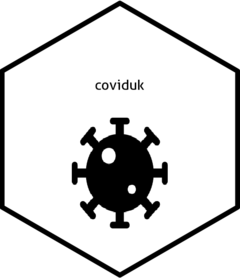

<!-- README.md is generated from README.Rmd. Please edit that file -->

# coviduk

<!-- badges: start -->

[](https://www.tidyverse.org/lifecycle/#experimental)

<!-- badges: end -->

The goal of coviduk is to make it easier to get data out of the official
[UK SARS-CoV-2 dashboard](https://coronavirus.data.gov.uk/). It does
this by wrapping up the API calls in simpler functions, reducing the
need to set various parameters manually and reduce repetitive code.

Currently the package only handles hospital admissions data (new daily
admissions and cumulative totals) and case numbers (by reported and
specimen date), but a more expansive range of data will be built in, at
least until the government’s developers release the R package promised
in their [developer’s
guide](https://coronavirus.data.gov.uk/developers-guide).

## Installation

You can install the development version of coviduk from Github.

``` r
devtools::install_github("shanej90/coviduk", ref = "main")
```

## How it works

As there’s only two in-use functions for now:

`get_hospital_admissions` will call hospitilisation data for a chosen
region and date range. The results will be presented as a dataframe,
stating the date, region and number of new and cumulative/total
admissions since records started.

The parameters you input will create a query to send to the coronavirus
dashboard API, saving you from having to type out the whole query. For
regions you can select any of the four UK nations, or the English NHS
regions.

Note that you can/will be throttled if you make too many requests -
you’ll get an error message explaining this if so. As such, better to
keep the number of requests low and/or leave gaps to avoid being
throttled.

## Example

This is a basic example which shows how you can get hold of the hospital
admissions data for a specific timeframe.

``` r
library(coviduk)

example <- coviduk::get_hospital_admissions("London", "2020-09-01", "2020-09-15")

head(example)
#>         date area_name area_code new_admissions total_admissions
#> 1 2020-09-01    London E40000003              6            24809
#> 2 2020-09-02    London E40000003             11            24820
#> 3 2020-09-03    London E40000003             15            24835
#> 4 2020-09-04    London E40000003             11            24846
#> 5 2020-09-05    London E40000003             23            24869
#> 6 2020-09-06    London E40000003             12            24881
```

And this example shows how you can get case data - also highlighting
that some data isn’t available at all available area structure levels.

``` r
library(coviduk)

example2 <- coviduk::get_case_data("ltla", "Exeter", "2020-09-01", "2020-09-15")

head(example2)
#>         date area_code area_name reported_new reported_total specimen_new
#> 1 2020-09-01 E07000041    Exeter            0             NA            1
#> 2 2020-09-02 E07000041    Exeter            0             NA            0
#> 3 2020-09-03 E07000041    Exeter            1             NA            5
#> 4 2020-09-04 E07000041    Exeter            0             NA            6
#> 5 2020-09-05 E07000041    Exeter            3             NA            1
#> 6 2020-09-06 E07000041    Exeter            2             NA            1
#>   specimen_total
#> 1            274
#> 2            274
#> 3            279
#> 4            285
#> 5            286
#> 6            287
```
